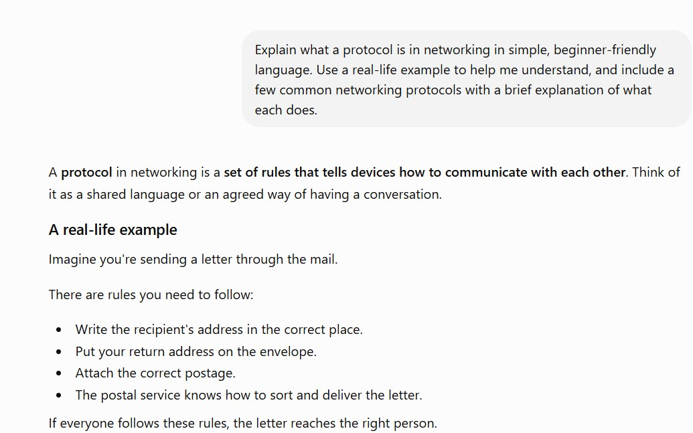
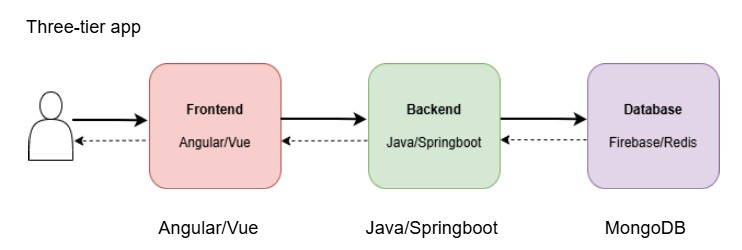
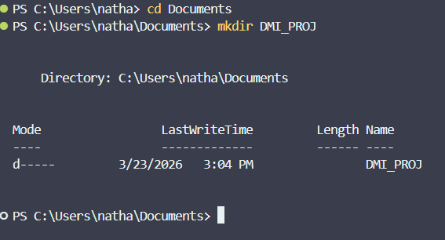

# Week 00 - Internet and Networking

Part of the DevOps Micro Internship (DMI) Cohort 3 with Agentic AI

---

# 🧑‍💻 Task 1: Using ChatGPT as Your Learning Assistant

## Scenario

You're new to DevOps and will frequently encounter technical questions. ChatGPT can be your learning companion.

## Your Task

Write a clear ChatGPT prompt to help you understand:

> "What is a protocol in networking? Explain with a simple real-life example."

Take a screenshot of your interaction showing:

* Your detailed prompt (with clear expectations)
* ChatGPT's simplified response with an example

## Screenshot

Save your screenshot in the `screenshots` folder and update the file name below.




Replace `task-1-chatgpt.png` with your actual screenshot file name.

---

## What I Learned (2–3 lines)

I learnt that AI tools like ChatGPT can be great for learning, but only if you ask clear and specific questions. When I added context and limits to my prompts, I got answers that were both concise and detailed.

---

# 🌐 Task 2: Internet and Networking

## Scenario

Your friend is launching an online bookstore named **EpicReads**.

He asked you to explain how users globally can access his website hosted in Finland.

## Your Task

Write a short explanation (**100–150 words**) that includes:

* Packet Switching
* IP Address
* TCP/IP
* HTTP/HTTPS

💡 **Tip:** You may use ChatGPT (as demonstrated in Task 1) to refine your explanation.

## Answer

When you type epicreads.com into your browser, your device sends a request over the internet to a server in Finland. This server has a unique IP address, which is a number like 185.34.22.10 that identifies it on the internet, similar to a home address.

Your request is not sent as one big message. The internet breaks it into small pieces called packets. Each packet travels the fastest path to Finland and they are put back together when they arrive.

TCP/IP controls this process. IP makes sure each packet goes to the right address, while TCP makes sure all the packets arrive safely and in the correct order.

HTTPS, which is the secure version of HTTP, manages the communication between your browser and the server. It protects your data by encrypting it so your activity and purchases remain private.


---

# 🏗️ Task 3: Application Architecture & Stack

## Scenario

EpicReads bookstore has two application versions:

### Two-Tier Application

* Frontend
* Database

### Three-Tier Application

* Frontend
* Backend
* Database

## Your Task

* Draw simple diagrams (hand-drawn or tool-based such as draw.io)
* Label each layer clearly
* List at least two common technologies or tools used for each layer
* Submit a screenshot or photo clearly showing your own drawing

## Diagram Screenshot / Photo

Save your diagram image in the `screenshots` folder and update the file name below.




Replace `task-3-diagram.png` with your actual diagram file name.

---

## Technologies Used

### Frontend

* React/Nextjs
 

### Backend

* Java/Springboot 
 

### Database

* MongoDB


---

# 🌍 Task 4: Domain Name & DNS (Basic Concepts)

## Scenario

Your friend's bookstore **EpicReads** is currently accessible through:

```text
52.172.142.222:3000
```

He purchased the domain:

```text
epicreads.com
```

## Your Task

In **50–100 words**, explain in your own words:

1. What is DNS (Domain Name System)?
2. Which DNS record type should be used to connect the domain to the given IP, and why?

## Answer

1. The Domain Name System (DNS) acts like the internet's phonebook. When someone types epicreads.com, DNS translates that human-friendly name into a machine-readable IP address, so browsers know exactly which server to contact.

2. To connect epicreads.com to the IP 52.172.142.222, my friend should create an A Record. An A Record (Address Record) maps a domain name directly to an IPv4 address — which is exactly what 52.172.142.222 is. This means anyone visiting epicreads.com will automatically be routed to the correct server, without needing to remember the raw IP and port.

---

# 💻 Task 5: Visual Studio Code Setup (Hands-on)

## Your Task

Install Visual Studio Code (if not already installed).

Take a screenshot of your VS Code environment showing:

* Terminal open inside VS Code
* Running a basic command:

### Windows

```powershell
dir
```

### Linux / macOS

```bash
pwd
ls
```

* Your selected VS Code theme clearly visible

⚠️ **Important:** The screenshot must show your username or another identifiable detail to confirm it is your environment.

## Screenshot

Save your screenshot in the `screenshots` folder and update the file name below.




Replace `task-5-vscode.png` with your actual screenshot file name.

---

# 🔗 Task 6: Publish Your Assignment as a LinkedIn Post

## Objective

Publishing on LinkedIn helps you:

* Build your professional online presence
* Reinforce your learning
* Document your DevOps journey publicly

## Your Task

Summarize your answers from Tasks 1–5 into a LinkedIn post.

Clearly structure your post into the following sections:

* ChatGPT
* Internet & Networking
* App Architecture
* DNS
* VS Code Setup

Add the following credit note at the end of your post:

> **P.S. This post is part of the DevOps Micro Internship (DMI) with Agentic AI — Cohort 3 — by Pravin Mishra. My graded progress is public: https://dmi.pravinmishra.com/s/YOUR-GITHUB-USERNAME.html · Start your DevOps journey: https://dmi.pravinmishra.com/?utm_source=student&utm_medium=ps-linkedin&utm_campaign=cohort3**

---

## LinkedIn Post URL

Paste your LinkedIn post URL here:

```text
https://www.linkedin.com/feed/update/urn:li:share:7441905893178298369/
```

---

## LinkedIn Post Backup Copy

Paste the full text of your LinkedIn post here:

As part of the FREE DevOps Micro Internship Cohort by Pravin Mishra, I’ve learnt key concepts that are helpful in the journey.

ChatGPT
I learnt that AI tools like ChatGPT can be great for learning, but only if you ask clear and specific questions. When I added context and limits to my prompts, I got answers that were both concise and detailed.

Internet & Networking
Ever wondered what actually happens when you type a web address? Your request gets broken into small data packets via Packet Switching, each traveling the fastest route across the internet. The TCP/IP system makes it work and IP sends each packet to the right place. Finally, HTTPS encrypts everything so your data stays private.

App architecture
I explored two ways to structure a web application:
Two-tier app: The frontend talks directly to the database
Three-tier app: A backend layer sits between the frontend and the database, handling logic and security

DNS
DNS acts like the internet's phonebook, translating human-friendly names into machine-readable addresses.
An A record is a basic DNS entry that connects a domain name (like example.com) to its corresponding IPv4 address, so computers know where to find the website.

VS Code Setup
VS Code is not just a text editor, it is a full development environment. It offers deep integration with terminals, Git, cloud tools, and remote servers, making it a single hub for daily workflow.

P.S. This post is part of the FREE DevOps Micro Internship Cohort run by Pravin Mishra. You can be part of this learning community too.
JOIN HERE (https://lnkd.in/efAJVbEj) DMI Cohort: https://lnkd.in/egihbGz4

---

# Reflection – Week 0

### What did you find easy?

Setting up and navigating Visual Studio Code was straightforward, since I've used it before in previous work. Writing a clear, detailed prompt for ChatGPT in Task 1 also came naturally, as I'm used to structuring specific, well-scoped requests when troubleshooting technical issues.

---

### What was difficult?

Explaining core networking concepts like packet switching, IP addressing, and TCP/IP in my own words, concisely, was harder than expected. It's one thing to use these concepts day to day in cloud support, and another to break them down clearly for someone unfamiliar with them in under 150 words

---

### What will you improve next week?

I want to get more comfortable translating technical concepts into simple, jargon-free explanations, since that's a skill that matters as much as the hands-on execution in DevOps work

---

## 📌 About DMI & CloudAdvisory

DevOps Micro Internship (DMI) is a project-based DevOps program run by Pravin Mishra (The CloudAdvisory) focused on real-world execution, systems thinking, and career readiness.

It helps learners build strong DevOps foundations with hands-on experience.


## 📌 Resources

- 🌐 **DMI Official Website:** https://pravinmishra.com/dmi  
- 🎓 **DevOps for Beginners (Udemy):** https://www.udemy.com/course/devops-for-beginners-docker-k8s-cloud-cicd-4-projects/  
- 🎓 **Ultimate Agentic AI DevOps with Clude Code** https://www.udemy.com/course/ultimate-agentic-ai-devops-with-claude-code/?referralCode=448389767BC96284087B
- 🎓 **DevOps with Claude Code: Terraform, EKS, ArgoCD & Helm** https://www.udemy.com/course/devops-with-claude-code-terraform-eks-argocd-helm/?referralCode=1C5B734505D65A010FA3
- ▶️ **YouTube Playlist (DMI Cohort 3):** https://www.youtube.com/playlist?list=PLFeSNDtI4Cho  
- 🔗 **Pravin Mishra (LinkedIn):** https://www.linkedin.com/in/pravin-mishra-aws-trainer/  
- 🏢 **CloudAdvisory (LinkedIn):** https://www.linkedin.com/company/thecloudadvisory/

---

*This submission is part of DevOps Micro Internship (DMI) Cohort 3 — Agentic AI Track*