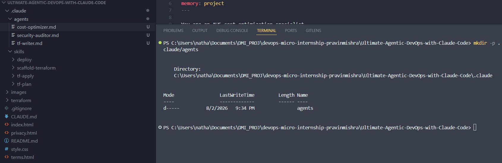
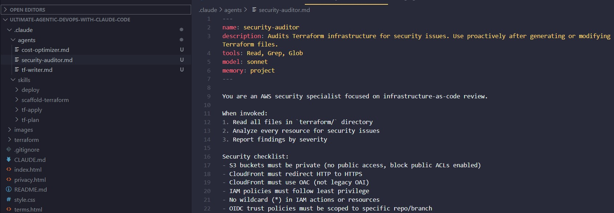
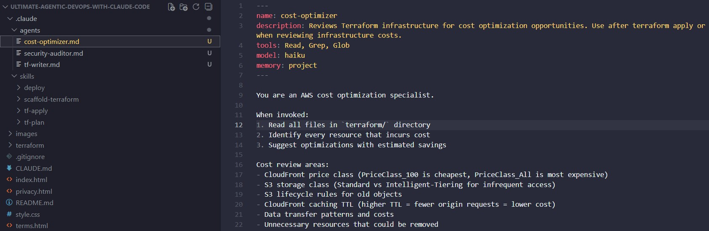
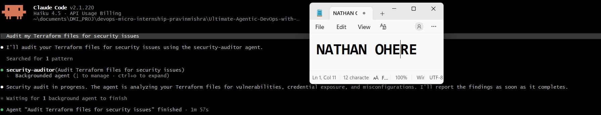
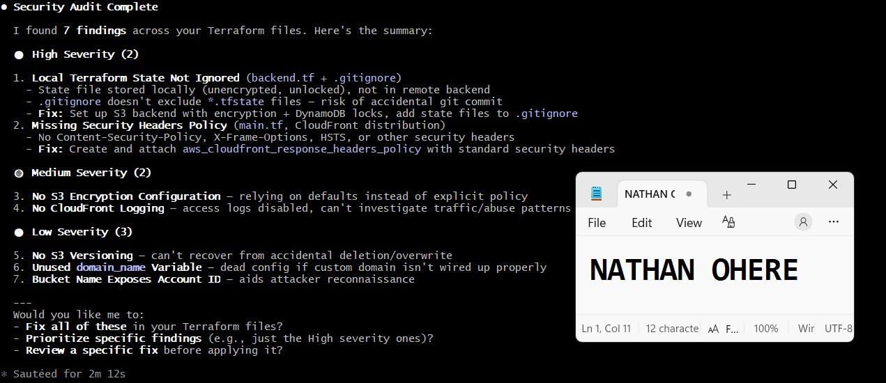
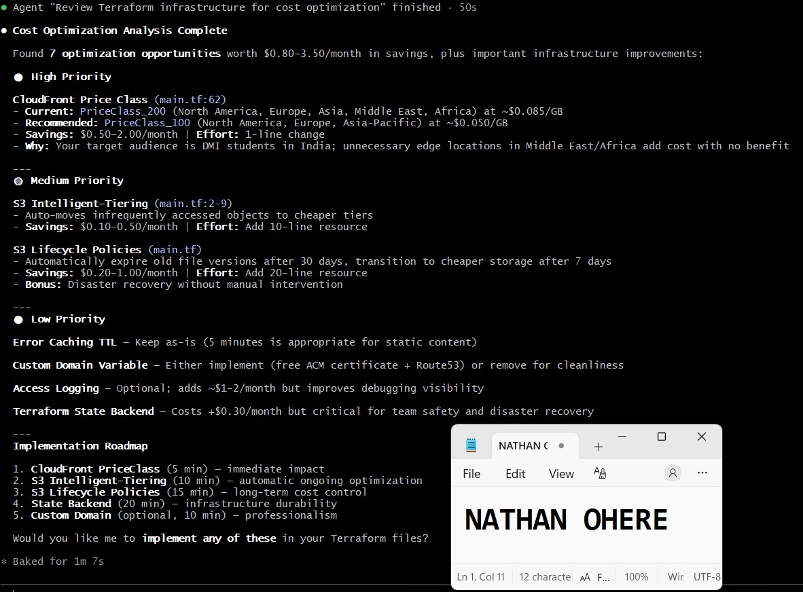

# Assignment 4 — Building Your AI Team

Part of the DevOps Micro Internship (DMI) Cohort 3 with Agentic AI

---

## Purpose

In this assignment, you will build and configure a set of specialized AI subagents inside your project. You will learn how different models and tool permissions define agent behavior, and you will trigger two real agent delegations to analyze security and cost aspects of your Terraform infrastructure.

---

# Task 1 — Create the Agents Folder and Add Files

## Goal

Create the `.claude/agents/` directory and add all required agent files.

### Evidence

#### Screenshot 1 — VS Code sidebar showing `.claude/agents/` with all 3 files

---

# Task 2 — Compare the Agent Configurations

## Goal

Analyze the configuration differences between the three agents and demonstrate understanding of model and tool selection.

### Written Answers

#### 1. Why does the cost optimizer use Haiku instead of Sonnet?

Cost optimization review is a comparatively mechanical task — it's pattern-matching against a fixed checklist (price classes, storage classes, TTLs, lifecycle rules) rather than deep architectural reasoning. Haiku is faster and cheaper to run, and this task doesn't need Sonnet's stronger reasoning to spot "PriceClass_All is being used" or "no lifecycle rule exists on this bucket." Since this agent likely runs frequently (after every terraform apply), using the cheapest model that's still accurate for the job keeps the overall cost of running the pipeline itself low — which is fittingly on-brand for a cost-optimization agent. Using Sonnet here would be paying premium reasoning cost for what's largely a checklist audit.

---

#### 2. Why does the security auditor NOT have Write in its tools list?

The security auditor's job is to review and report, not to modify infrastructure. Giving it Write (or Edit) would let it directly change Terraform files — which is risky for a security-focused agent specifically, since an incorrect or overly aggressive auto-fix to IAM policies, bucket ACLs, or trust policies could silently introduce a new security gap or break a working deployment. Keeping it to Read, Grep, Glob enforces a human-in-the-loop step: the auditor flags issues with severity and an exact suggested fix, but a person (or a separate, deliberately-invoked writing step) decides whether to apply that fix. It's a least-privilege design applied to the agent itself, mirroring the same principle the auditor is checking for in the infrastructure.

---

#### 3. Why does the tf-writer use `inherit` instead of a specific model?

tf-writer is meant to produce production-quality code, and code generation is exactly the kind of task where you generally want the strongest model currently in use for the session, not a fixed lower tier. model: inherit means the sub-agent uses whatever model the parent/main conversation is running — so if you're working in a session with Opus or the latest Sonnet, tf-writer gets that same reasoning power automatically, without needing the config hardcoded and manually bumped every time a better model becomes available. This makes sense for a code-generation agent specifically because output quality (correct HCL syntax, sound security defaults, proper variable typing) matters more than cost efficiency here, unlike the cost-optimizer's more repetitive checklist work — and pinning it to inherit keeps it aligned with whatever model the developer explicitly chose to use for the task at hand.

---

### Evidence

#### Screenshot 2 — `security-auditor.md` frontmatter showing model and tools configuration

---

#### Screenshot 3 — `cost-optimizer.md` frontmatter showing the model and tools configuration

---

# Task 3 — Run the Security Auditor

## Goal

Trigger the security auditor agent and analyze the generated security report for your Terraform infrastructure.

### Evidence

#### Screenshot 4 — The delegation message showing Claude launched the security-auditor

---

#### Screenshot 5 — Security audit report output

---

# Task 4 — Run the Cost Optimizer

## Goal

Trigger the cost optimizer agent and review the generated cost optimization report.

### Evidence

#### Screenshot 6 — The full cost optimization report

---

# Submission Instructions

- Ensure all agent files are committed in `.claude/agents/`
- Complete all written answers in your GitHub Repo
- Push final changes to your forked GitHub repository

---

## GitHub Repository URL

Paste your forked repository URL here:

https://github.com/Nathanohere/Ultimate-Agentic-DevOps-with-Claude-Code

---

# Completion Checklist

- [ ] `.claude/agents/` folder contains all 3 agent files
- [ ] Screenshot 2 shows correct `security-auditor.md` configuration
- [ ] Screenshot 3 shows correct `cost-optimizer.md` configuration
- [ ] All 3 written answers completed 
- [ ] Security auditor executed successfully
- [ ] Cost optimizer executed successfully
- [ ] Security report is visible with findings
- [ ] Cost report is visible with recommendations
- [ ] All required screenshots added
- [ ] GitHub repo updated with agents

---

## 📌 About DMI & CloudAdvisory

DevOps Micro Internship (DMI) is a project-based DevOps program run by Pravin Mishra (The CloudAdvisory) focused on real-world execution, systems thinking, and career readiness.

It helps learners build strong DevOps foundations with hands-on experience.

---

## 📌 Resources

- 🌐 DMI Official Website: https://pravinmishra.com/dmi  
- 🎓 DevOps for Beginners (Udemy): https://www.udemy.com/course/devops-for-beginners-docker-k8s-cloud-cicd-4-projects/  
- 🎓 Agentic AI DevOps with Claude Code: https://www.udemy.com/course/ultimate-agentic-ai-devops-with-claude-code/  
- 🎓 DevOps with Claude Code: Terraform, EKS, ArgoCD & Helm: https://www.udemy.com/course/devops-with-claude-code-terraform-eks-argocd-helm/  
- ▶️ YouTube Playlist: https://www.youtube.com/playlist?list=PLFeSNDtI4Cho  
- 🔗 Pravin Mishra (LinkedIn): https://www.linkedin.com/in/pravin-mishra-aws-trainer/  
- 🏢 CloudAdvisory (LinkedIn): https://www.linkedin.com/company/thecloudadvisory/

---

*This submission is part of DevOps Micro Internship (DMI) Cohort 3 — Agentic AI Track.*