# Assignment 3 — Production Maintenance Drill (OPS Checklist)

Part of the DevOps Micro Internship (DMI) Cohort 3 with Agentic AI

---

## Purpose

In this assignment, you will treat your already deployed React application (on Ubuntu VM with Nginx) as a live production system. You will perform structured operational checks covering network validation, service health, log analysis, resource monitoring, configuration verification, and incident simulation with recovery — mirroring real on-call DevOps responsibilities.

---

# Task 1 — Server Access & Networking Validation

## Goal

Verify that the deployed React application is reachable from the browser and confirm basic network connectivity of the Ubuntu VM.

### Evidence

#### Screenshot 1 — Browser showing the React app with your Full Name visible on the UI

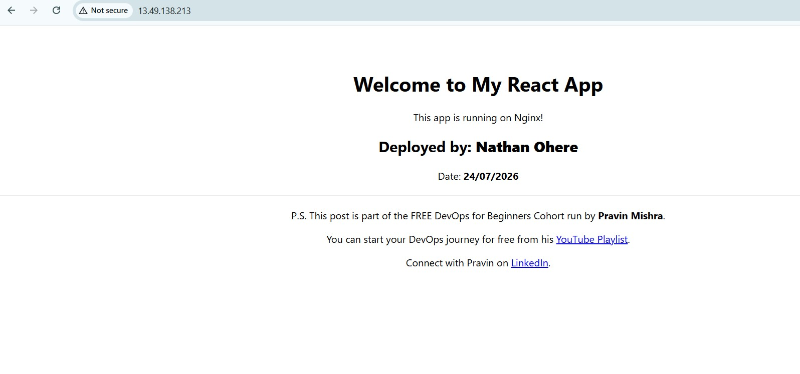

---

#### Screenshot 2 — Output of `ip a`

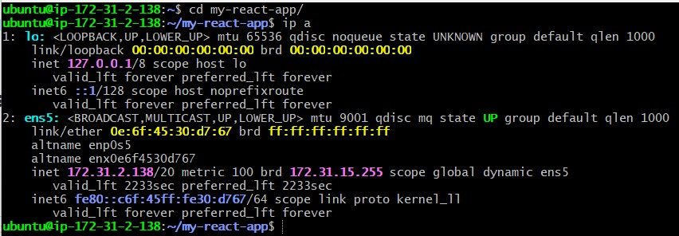

---

#### Screenshot 3 — Output of `sudo ss -tulpen`

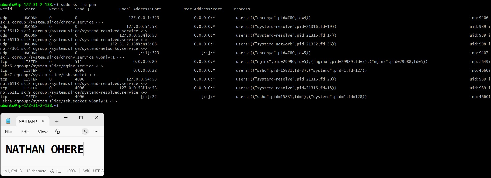

---

#### Screenshot 4 — Output of `sudo ufw status`

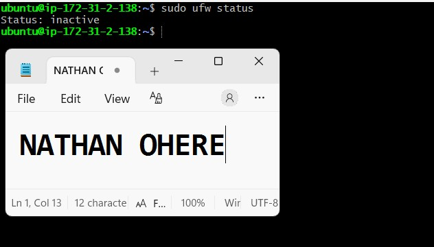

---

### Notes

Answer the following in your own words:

**1. What proves Nginx is listening on 0.0.0.0:80?**

In the ss -tulpen output, there's a line showing port 80 in the LISTEN state, bound to 0.0.0.0 (meaning it accepts connections from any IP, not just the local machine). The process column lists three nginx entries, these are Nginx's worker processes. Together, this confirms Nginx is running and actively listening for web traffic on port 80.

---

**2. What proves SSH is active on port 22?**

The same output also shows port 22 in the LISTEN state, bound to 0.0.0.0. The process column shows sshd, confirming the SSH service is running and listening for connections. There's a matching entry for [::]:22 as well, which is just the same thing but for IPv6.

---

**3. Did you find any unexpected open ports? Explain briefly.**

No unexpected ports were found. Every listening socket maps to a known, expected service:
•	nginx on 80 (your web server)
•	sshd on 22 (remote access)
•	chronyd on 323 (NTP time sync, local-only)
•	systemd-resolved on 53 (local DNS resolver, bound to loopback only)
•	systemd-networkd (DHCP client communication)

---

# Task 2 — Service Health & Systemd Validation (Nginx)

## Goal

Verify that Nginx is properly installed, running, enabled at boot, and safely configured.

### Evidence

#### Screenshot 1 — Output of `systemctl status nginx --no-pager`

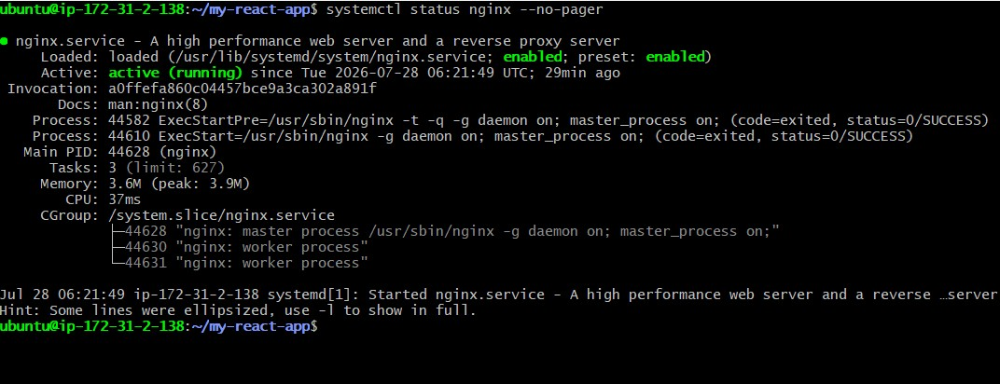

---

#### Screenshot 2 — Output of `sudo nginx -t`

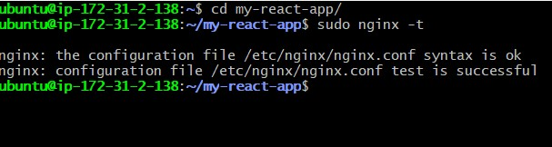

---

#### Screenshot 3 — Output of `sudo ss -lptn '( sport = :80 )'`

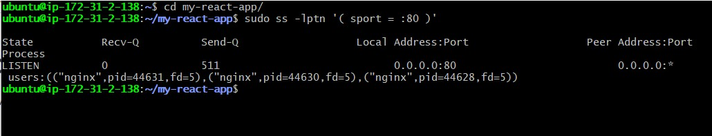

---

### Notes

Answer the following in your own words:

**1. What happens if Nginx fails to restart in production?**

If Nginx fails to restart, the website stops working right away and anyone trying to visit it will see a "connection refused" or timeout error, since nothing is listening on port 80 anymore. Any users already connected would also get disconnected. This is exactly why it's important to run nginx -t to check the config before restarting as most restart failures happen because of a config mistake, and testing first helps catch that before it causes downtime.
---

**2. What's your basic rollback plan?**

This will be my rollback plan
First, I'd check the error log (sudo journalctl -u nginx or /var/log/nginx/error.log) to figure out what actually went wrong. Then I'd revert the config file back to the last version I know was working, this is why I always make a backup copy before editing anything (e.g. sudo cp nginx.conf nginx.conf.bak), so I always have something safe to fall back to. Once reverted, I'd run sudo nginx -t again to make sure the restored config is valid before touching the service. If it passes, I'd restart Nginx. If it still refuses to start, I'd also check whether the React build files in /var/www/html were the actual problem and roll those back to the last working deployment too.

---

# Task 3 — Logs & Request Trace

## Goal

Verify real traffic flow and analyze logs to understand system behavior and errors.

### Evidence

#### Screenshot 1 — Output of `sudo tail -n 30 /var/log/nginx/access.log`

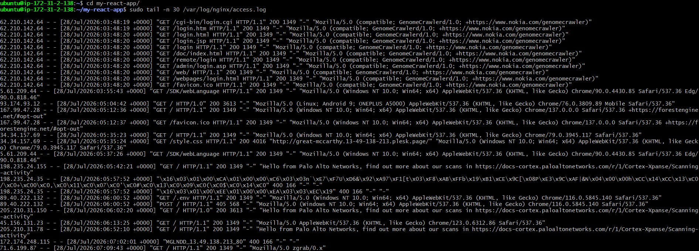

---

#### Screenshot 2 — Output of `sudo tail -n 30 /var/log/nginx/error.log`

---

#### Screenshot 3 — Output of `sudo journalctl -u nginx --no-pager -n 50`

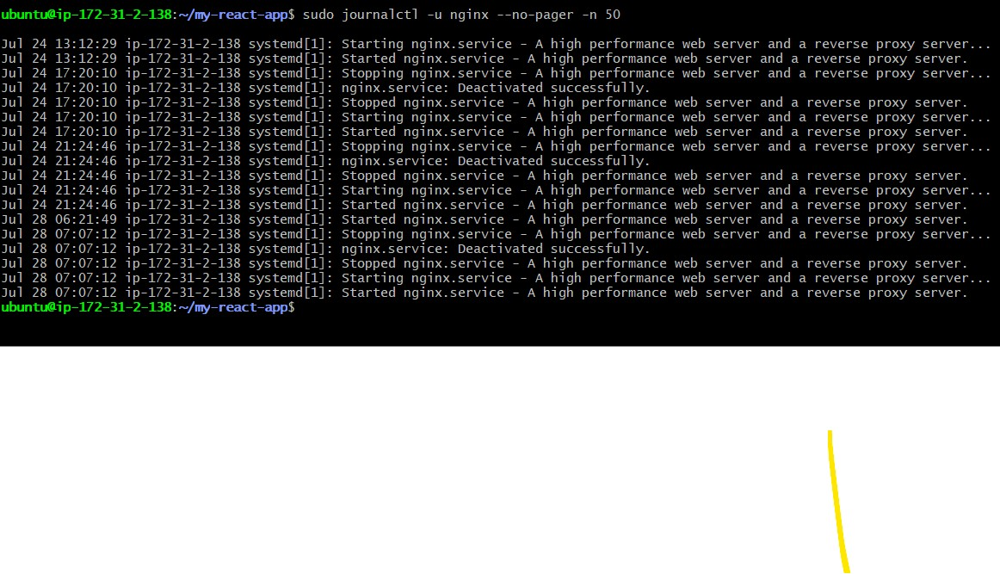

---

### Notes

Answer the following in your own words:

**1. Were there any errors in the logs?**

- If yes, mention 1–2 example error lines from the logs and explain what each one means in simple terms.
- If no, explain what it means if the error log is empty or shows no recent errors during your check.

No, the error log came back completely empty and the journalctl output for nginx only shows normal service lifecycle events, no warnings or failures. The access log did show a lot of noise, but nothing that counts as an "error". 
---

**2. If there were no errors, what does that indicate about the system?**

An empty error log combined with clean start/stop cycles in journalctl indicates nginx is running in a healthy, stable state, it isn't crashing, restarting unexpectedly, or failing to serve requests. Every request it received was handled and logged without nginx itself throwing errors, which means the web server process and its configuration are working as intended.

---

**3. Based on the access logs, were your curl requests visible in the log entries? What does that prove about traffic flow?**

Yes. I found entries from my IP (13.49.138.213) in the access log — a "GET / HTTP/1.1" 200 request and a "HEAD / HTTP/1.1" 200 request from "curl/8.18.0" — matching the exact curl commands I ran, with the same timing as the 200 OK response I saw earlier. This proves the full request path actually works: my request reached the server, nginx processed it, sent back a 200 OK, and logged it correctly. So the success I saw on my end wasn't a fluke — real traffic is flowing through the server.

---

# Task 4 — System Resource Health Check (Capacity Red Flags)

## Goal

Assess server capacity and detect potential performance or failure risks.

### Evidence

#### Screenshot 1 — Output of `uptime`

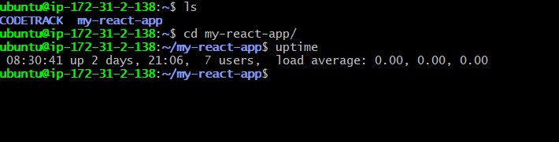

---

#### Screenshot 2 — Output of `free -h`

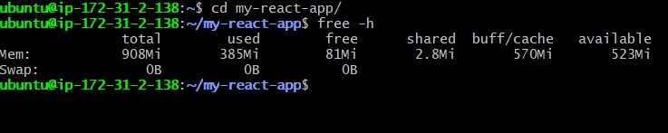

---

#### Screenshot 3 — Output of `df -h`

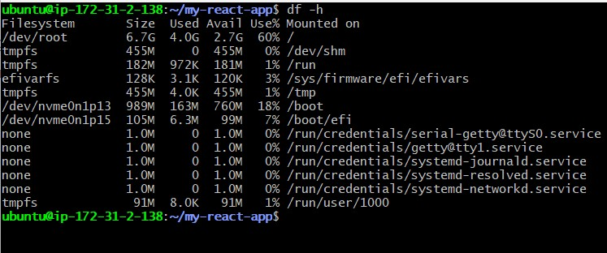

---

#### Screenshot 4 — Output of `sudo du -sh /var/* | sort -h`

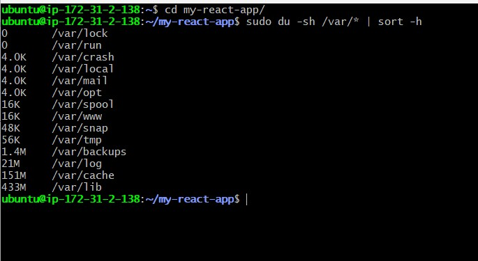

---

### Notes

Answer the following in your own words:

**1. Which resource looks most critical right now? (CPU/load, memory, or disk) Explain why.**

Right now, nothing is in danger, but memory is the one closest to being tight. 
The CPU load is 0.00 (Image 2), so the processor isn't doing much work. Disk usage 
is at 60% (Image 4), which is still fine. Memory is the smallest resource here — 
only 908Mi total, with 385Mi already used and just 81Mi truly free (Image 3). It's 
not a problem yet since 523Mi is still available for use, but because the total 
RAM is so small, memory would run out first if traffic or usage increased.

---

**2. What happens if disk becomes 100% full in a production server?**

If the disk fills up completely, the server can't save any new data. Logs stop 
writing, the app may crash or fail to save files, and services like the database 
or web server can stop working properly. In short, the whole system can freeze up 
or break, so disk space needs to be watched and cleaned before it gets too full.

---

# Task 5 — Configuration & Deployment Verification

## Goal

Ensure the correct React build is deployed and Nginx is serving it properly.

### Evidence

#### Screenshot 1 — Output of `ls -lah /var/www/html | head -n 20`

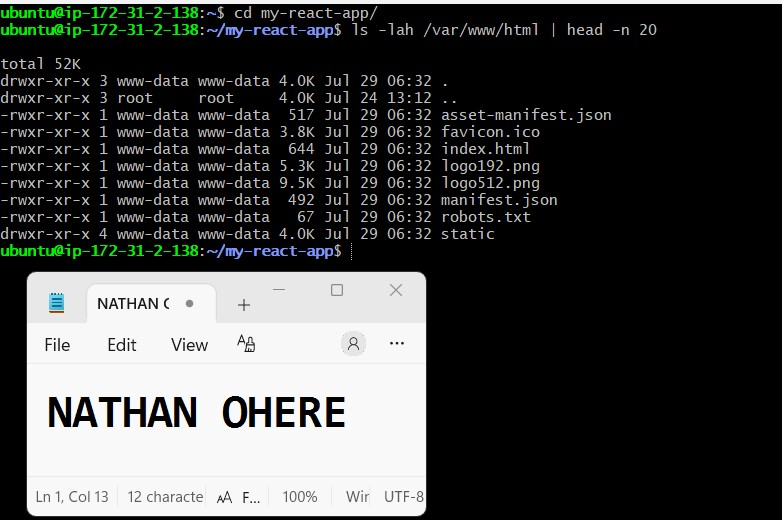

---

#### Screenshot 2 — Output of `grep -R "Deployed by" -n /var/www/html 2>/dev/null | head`

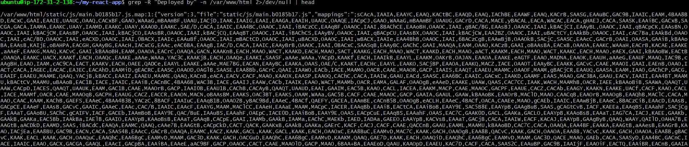

---

#### Screenshot 3 — Output of `grep -n "try_files" /etc/nginx/sites-available/default`

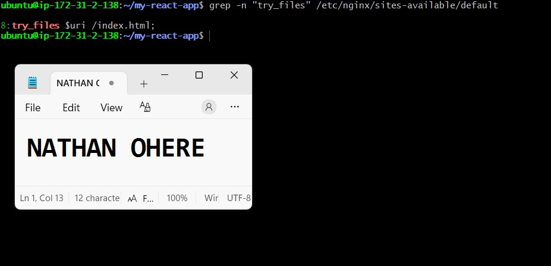

---

### Notes

Answer the following in your own words:

**1. How do you confirm that the correct version of the application is deployed?**

Deployment validation was not based on a single command but confirmed through several independent checks. Inspection of /var/www/html showed a genuine production build from Create React App, including index.html, the static/ directory with compiled JavaScript and CSS bundles, and standard CRA metadata files, all owned by www-data to match Nginx’s worker processes. A build signature check using grep -R "Deployed by" verified that the custom identifier was embedded in the compiled bundle, with the source map confirming the build was produced directly from the source code rather than an outdated artifact. Routing validation with grep -n "try_files" demonstrated that the Nginx configuration correctly redirected unmatched paths to index.html, ensuring proper single‑page application handling of deep links. Finally, these findings were tied to the earlier curl test from Task 3, which showed the server returning the same index.html content over HTTP, linking the on‑disk build to what Nginx serves to real clients and completing the end‑to‑end verification.

---

# Task 6 — Nginx Configuration Failure Simulation

## Goal

Simulate a real-world Nginx misconfiguration and recover the service safely.

### Evidence

#### Screenshot 1 — Output of `sudo nginx -t` showing the syntax error (broken config)

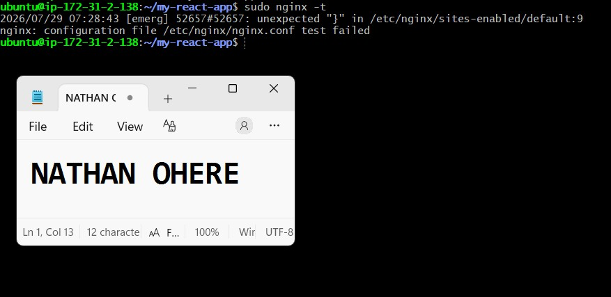

---

#### Screenshot 2 — Output of `sudo nginx -t` showing syntax ok (fixed config)

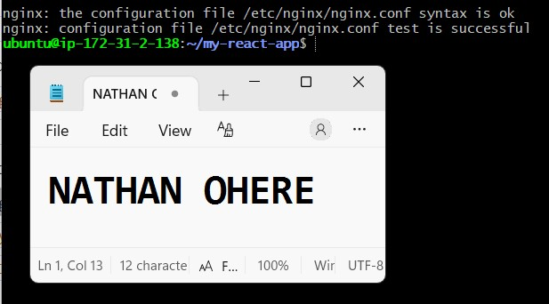

---

#### Screenshot 3 — Output of `curl -I http://<public-ip>` confirming recovery (200 OK)

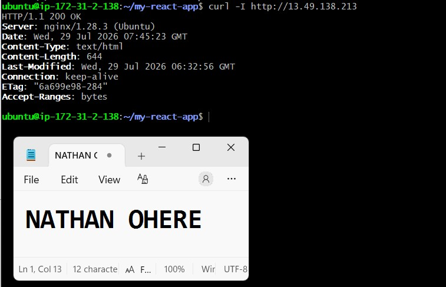

---

### Notes

Answer the following in your own words:

**1. What caused the configuration failure?**

Removing the semicolon from `try_files $uri /index.html` broke nginx's config syntax. Nginx uses semicolons to mark the end of each directive — without it, nginx couldn't tell where that line ended and the next one began. This is confirmed in Image 2: `sudo nginx -t` returned `unexpected "}" in /etc/nginx/sites-enabled/default:9` and `nginx: configuration file /etc/nginx/nginx.conf test failed` — nginx got confused and hit the closing brace `}` before it expected to, because the missing semicolon made it think the previous line hadn't finished.

---

**2. How did you fix the issue?**

I reopened the config file with `sudo nano /etc/nginx/sites-available/default` and re-added the missing semicolon back to the end of the `try_files` line, restoring it to `try_files $uri /index.html;`. Running `sudo nginx -t` again confirmed the fix — Image 3 shows `syntax is ok` and `test is successful`. I then restarted nginx with `sudo systemctl restart nginx`, and confirmed full recovery with `curl -I http://13.49.138.213`, which returned `HTTP/1.1 200 OK` (Image 1) — proving the site was back up and serving correctly.

---

**3. How can you avoid this kind of issue in real production systems?**

Always run `sudo nginx -t` to validate a configuration *before* restarting or reloading the service — this catches syntax errors before they take the live site down. In real production, this can also be automated: config changes go through version control (e.g. Git) so bad edits can be reviewed and rolled back easily, and CI/CD pipelines can run `nginx -t` automatically before deploying any config change. Using `systemctl reload nginx` instead of `restart` is also safer, since reload only applies a validated config without fully dropping active connections.

---

# Task 7 — Web Application Failure Simulation

## Goal

Simulate missing deployment content and recover the application safely.

### Evidence

#### Screenshot 1 — Output of `curl -I http://<public-ip>` showing failure (non-200 response)

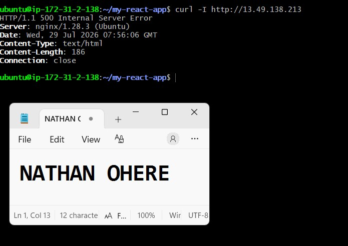

---

#### Screenshot 2 — Output of `curl -I http://<public-ip>` confirming recovery (200 OK)

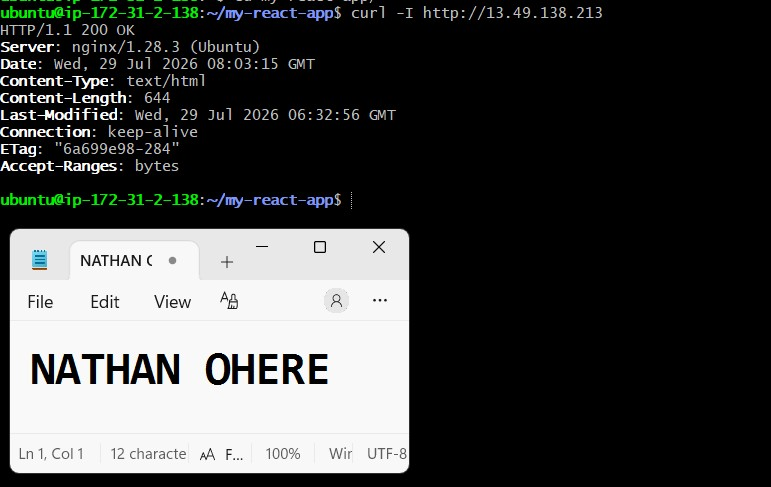

---

### Notes

Answer the following in your own words:

**1. What caused the application to break in this scenario?**

The web root directory (/var/www/html) that nginx serves files from was moved away (renamed to /var/www/html_backup) and replaced with a brand new empty folder. Since there were no files inside it — no index.html, no static assets, nothing — nginx had nothing to serve when a request came in. This is confirmed in Image 2, where `curl -I` returned `HTTP/1.1 500 Internal Server Error` instead of the normal 200 OK.

---

**2. How did you fix the issue and restore the application?**

I removed the empty placeholder directory with `sudo rm -rf /var/www/html`, then restored the original files by moving the backup back into place with `sudo mv /var/www/html_backup /var/www/html`. After that, I restarted nginx with `sudo systemctl restart nginx` so it would pick up the restored content. Running `curl -I http://13.49.138.213` afterward confirmed the fix — Image 1 shows `HTTP/1.1 200 OK` returned again, meaning the application was serving correctly.

---

**3. What steps would you take to prevent this kind of issue in real production systems?**

Never delete or replace a live web directory directly on a production server. Instead, deployments should go through a proper pipeline — build the new version in a separate folder, test it, then atomically swap it into place (e.g. using a symlink pointing to versioned release folders, so rollback is instant if something goes wrong). Regular backups of the web root should be taken before any deployment, and monitoring/alerting should be in place so a 500 error gets caught within seconds rather than being discovered manually. Using infrastructure-as-code or CI/CD (so deployments are repeatable and reviewed) also reduces the chance of a manual mistake like this happening in the first place.

---

# Task 8 — Security & Reliability Review

## Goal

Review and reflect on the security and reliability practices applied during this assignment.

### Security & Reliability Notes

Answer the following in your own words:

**1. Why is SSH key-based authentication more secure than sharing passwords?**

SSH keys use a public/private key pair instead of a single secret string that has to be typed and transmitted. The private key never leaves your machine, so there's nothing sent over the network that could be intercepted or guessed. Passwords, on the other hand, can be brute-forced, guessed, phished, or accidentally shared/reused across systems. Keys are also much longer and more complex than any human-memorable password, making them practically impossible to crack, and access can be revoked instantly by simply removing a public key — no need to change a shared secret everyone knows.

---

**2. Why should only required ports be open on a production server?**

Every open port is a potential entry point for an attacker. If a port is open but not actually needed (e.g., a database port exposed to the public internet, or a leftover dev service), it increases the "attack surface" — more ways for someone to probe, exploit, or gain unauthorized access to the server. Keeping only essential ports open (like 22 for SSH and 80/443 for web traffic) means there are fewer opportunities for something to go wrong, and it's easier to monitor and secure a small, well-defined set of services rather than everything that happens to be running.

---

**3. Why is it important for Nginx to be enabled on boot?**

If nginx isn't enabled on boot, then any time the server restarts — whether from a planned maintenance reboot, a crash, or an AWS instance stop/start — the web server won't come back up automatically, and the application will be down until someone manually logs in and starts it. Enabling nginx on boot (`systemctl enable nginx`) ensures the service restarts itself along with the OS, minimizing downtime and removing the need for manual intervention every time the server restarts.

---

**4. What are the risks of sharing secrets, keys, or credentials publicly?**

If secrets like SSH private keys, API keys, passwords, or AWS access credentials are exposed publicly (e.g., committed to GitHub, pasted in a screenshot, or shared in chat), anyone who finds them can impersonate you or your systems. This can lead to unauthorized access to your servers, data theft, resource hijacking (like someone spinning up expensive cloud instances on your account for crypto mining), malware deployment, or complete takeover of the application. In cloud environments especially, leaked credentials are one of the most common causes of major security breaches, and the damage can rack up huge costs before it's even noticed. Once a secret is exposed, it should be treated as compromised and rotated/revoked immediately, since you can't guarantee who else may have seen it.

---

**5. Why should cloud resources be stopped or terminated when they are no longer needed?**

Cloud providers charge for resources as long as they're running, regardless of whether they're actually being used — so leaving an EC2 instance, database, or storage volume running idle wastes money unnecessarily. Beyond cost, unused running resources are also unmonitored attack surface: an old test server nobody's paying attention to is more likely to have outdated software, unpatched vulnerabilities, or weak configurations that go unnoticed. Stopping or terminating resources you no longer need keeps your cloud environment clean, cost-efficient, and reduces the number of things that could potentially be exploited.

---

# LinkedIn Post (Required)

## Evidence

#### LinkedIn Post URL

Paste your LinkedIn post URL here:

https://www.linkedin.com/feed/update/urn:li:share:7488177916267241474/

---

#### Screenshot — Published LinkedIn post

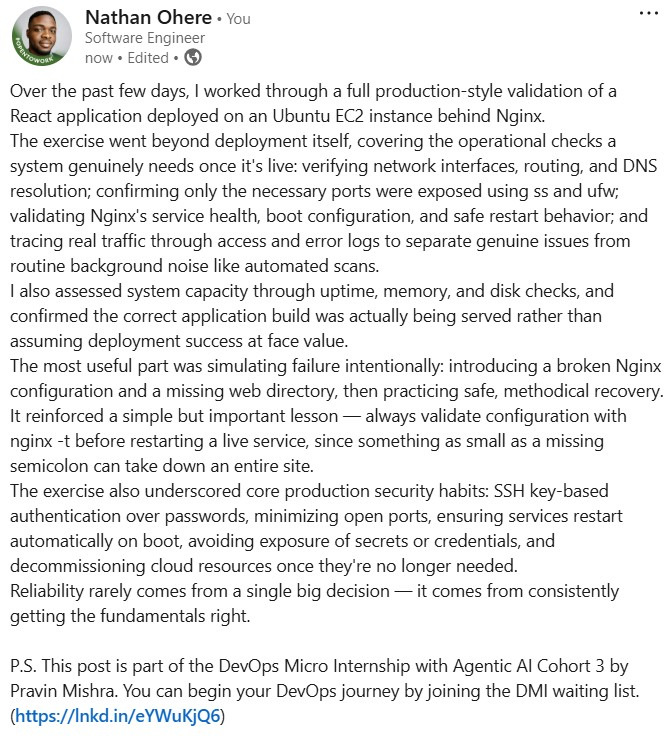

---

# Submission Instructions

- Add all required screenshots in your submission
- Full name must be visible in required screenshots
- Do not expose sensitive information (keys, passwords, account IDs)

---

# Completion Checklist

- [ ] Task 1: Screenshots (browser, ip a, ss -tulpen, ufw status) + Notes answered
- [ ] Task 2: Screenshots (nginx status, nginx -t, ss port 80) + Notes answered
- [ ] Task 3: Screenshots (access log, error log, journalctl) + Notes answered
- [ ] Task 4: Screenshots (uptime, free -h, df -h, du -sh) + Notes answered
- [ ] Task 5: Screenshots (ls html, grep deployed by, grep try_files) + Notes answered
- [ ] Task 6: Screenshots (nginx -t fail, nginx -t pass, curl recovery) + Notes answered
- [ ] Task 7: Screenshots (curl failure, curl recovery) + Notes answered
- [ ] Task 8: Security & Reliability Notes answered
- [ ] LinkedIn post published and URL submitted
- [ ] Full Name visible in all required screenshots
- [ ] No sensitive data exposed

---

## 📌 About DMI & CloudAdvisory

DevOps Micro Internship (DMI) is a project-based DevOps program run by Pravin Mishra (The CloudAdvisory) focused on real-world execution, systems thinking, and career readiness.

It helps learners build strong DevOps foundations with hands-on experience.

---

## 📌 Resources

- 🌐 DMI Official Website: https://pravinmishra.com/dmi  
- 🎓 DevOps for Beginners (Udemy): https://www.udemy.com/course/devops-for-beginners-docker-k8s-cloud-cicd-4-projects/  
- 🎓 Agentic AI DevOps with Claude Code: https://www.udemy.com/course/ultimate-agentic-ai-devops-with-claude-code/  
- 🎓 DevOps with Claude Code: Terraform, EKS, ArgoCD & Helm: https://www.udemy.com/course/devops-with-claude-code-terraform-eks-argocd-helm/  
- ▶️ YouTube Playlist: https://www.youtube.com/playlist?list=PLFeSNDtI4Cho  
- 🔗 Pravin Mishra (LinkedIn): https://www.linkedin.com/in/pravin-mishra-aws-trainer/  
- 🏢 CloudAdvisory (LinkedIn): https://www.linkedin.com/company/thecloudadvisory/

---

*This submission is part of DevOps Micro Internship (DMI) Cohort 3 — Agentic AI Track.*