# Assignment 5 — Bash Script Automation Drill (OPS Checklist)

Part of the DevOps Micro Internship (DMI) Cohort 3 with Agentic AI

---

## Purpose

In this assignment, you will practice Bash scripting by building a series of small automation scripts covering environment setup, variables, arrays, loops, file conditionals, if-else logic, and functions. These scripts form the foundation of real-world Linux automation used in DevOps, cloud, and production support environments.

---

# Task 1 — Bash Environment & Workspace Setup

## Goal

Verify that Bash is available on your system and create a clean workspace for this assignment.

### Evidence

#### Screenshot 1 — Output of `echo $SHELL` and `bash --version`

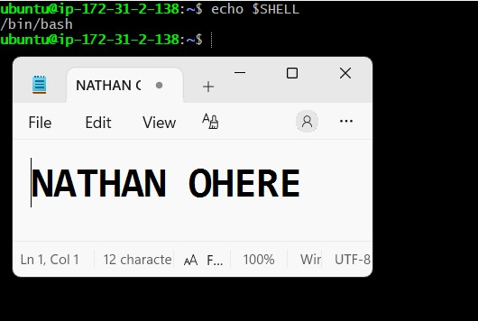

---

#### Screenshot 2 — Output of `pwd` and `ls -lah` showing the scripts directory

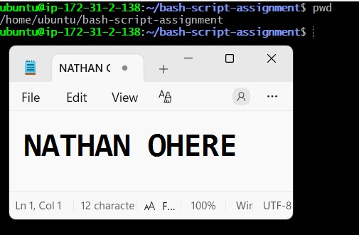

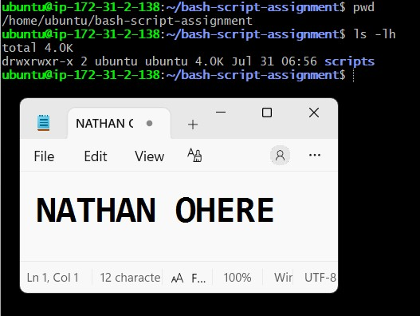
---

### Notes

Answer the following in your own words:

**1. What is Bash?**

Bash (Bourne Again Shell) is a command-line interpreter and scripting language used mainly on Linux and Unix-based systems. It lets users type commands directly to interact with the operating system, and it can also run saved sets of commands (scripts) to automate repetitive tasks. Bash is the default shell on most Linux distributions, including Ubuntu, which is why it's the standard choice for writing automation and DevOps script.

---

**2. What is the difference between shell and Bash?**

A shell is the general term for any program that provides a command-line interface between the user and the operating system — it interprets the commands you type and passes them to the OS to execute. Bash is one specific type of shell, among others like sh, zsh, ksh, or csh. In other words, "shell" is the broad category, and Bash is one particular implementation of a shell — just as "browser" is a category and "Chrome" is one specific browser.

---

**3. Why is it important to confirm the Bash version before writing scripts?**

Different Bash versions support different features and syntax — some newer scripting features (like certain array handling, string manipulation, or associative arrays) won't work on older Bash versions, and some older syntax may behave differently or be deprecated in newer versions. Confirming the version beforehand helps avoid compatibility issues, ensures the script will actually run correctly on the target system, and helps with debugging if a script behaves unexpectedly on one server but not another.

---

# Task 2 — Your First Bash Script

## Goal

Create your first Bash script, make it executable, and run it from the terminal.

### Evidence

#### Screenshot 1 — Content of `first-script.sh`

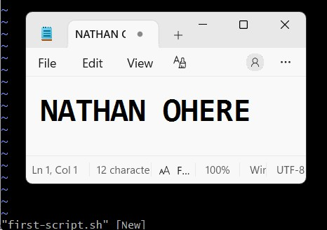
---

#### Screenshot 2 — Output of `./first-script.sh`

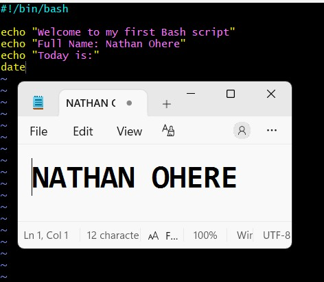
---

#### Screenshot 3 — Output of `ls -l first-script.sh` showing executable permission

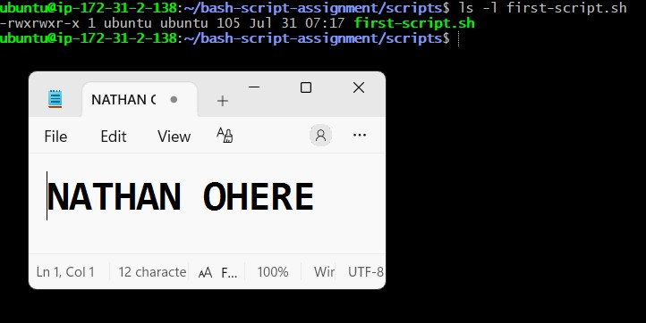

---

### Notes

Answer the following in your own words:

**1. What is the purpose of `#!/bin/bash`?**

This is called the shebang line, and it must be the very first line of a script. It tells the operating system which interpreter should be used to run the file — in this case, Bash. Without it, the system wouldn't know whether to treat the script as a Bash script, a Python script, or something else, especially when the file is executed directly (like with ./script.sh).

---

**2. Why do we use `chmod +x` before running a script?**

By default, a newly created script file doesn't have execute permission — it can only be read or written to, not run as a program. chmod +x adds the execute permission to the file, which allows it to be run directly (e.g., ./first-script.sh). Without this step, trying to execute the script directly would result in a "Permission denied" error.

---

**3. What is the difference between running a script using `./script.sh` and `bash script.sh`?**

./script.sh runs the file as an independent executable, relying on the shebang line (#!/bin/bash) at the top to determine which interpreter to use — and it requires the file to have execute permission (chmod +x) first. bash script.sh, on the other hand, explicitly tells the system to run the file using Bash, regardless of what shebang line is present (or even if there isn't one) — and it doesn't require the file to have execute permission at all, since Bash is reading and interpreting the file's contents directly rather than executing it as a standalone program.

---

# Task 3 — Variables: User Information Script

## Goal

Use variables to store and display user-related information.

### Evidence

#### Screenshot 1 — Content of `user-info.sh`

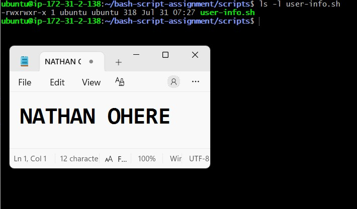

---

#### Screenshot 2 — Output of `./user-info.sh`

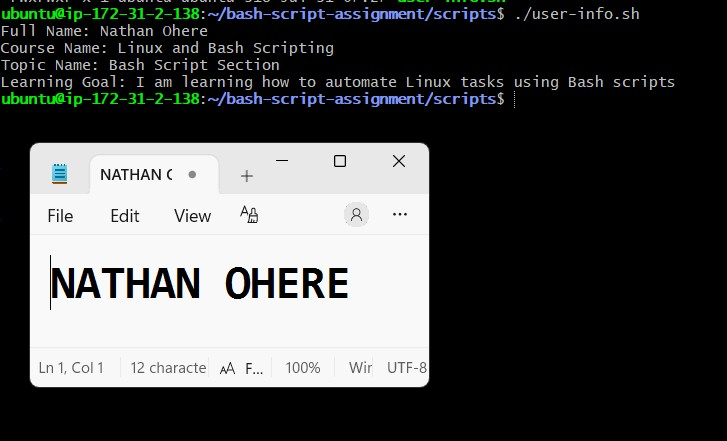

---

### Notes

Answer the following in your own words:

**1. What is a variable in Bash?**

A variable in Bash is a named container used to store a piece of data — like text, a number, or the output of a command — so it can be reused later in a script without having to retype it. For example, a variable could hold a username, a file path, or a date, and the script can then reference that variable wherever the value is needed instead of hardcoding it repeatedly.

---

**2. Why should we avoid spaces around the `=` sign when creating variables?**

In Bash, spaces around the = sign break the assignment syntax. Bash interprets `name = value` (with spaces) as trying to run a command called `name` with arguments `=` and `value`, rather than as an assignment — which results in an error like "command not found." The correct syntax, `name=value` (no spaces), is required for Bash to recognize it as a variable assignment.
---

**3. How do you access the value stored inside a Bash variable?**

You access a variable's value by prefixing its name with a dollar sign ($). For example, if a variable is defined as `name="Nathan"`, you would reference its value using `$name` or `${name}` (the curly braces are useful when the variable name needs to be clearly separated from surrounding text, like in `${name}_file`).

---

# Task 4 — Arrays & Loops: Tools Checklist Script

## Goal

Use arrays and loops to print a checklist of tools used in Bash scripting.

### Evidence

#### Screenshot 1 — Content of `tools-checklist.sh`

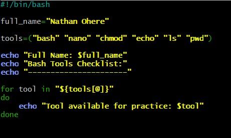

---

#### Screenshot 2 — Output of `./tools-checklist.sh`

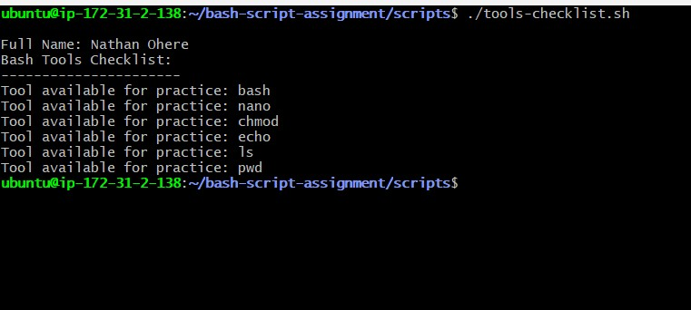

---

### Notes

Answer the following in your own words:

**1. What is an array in Bash?**

An array in Bash is a variable that can hold multiple values at once, instead of just a single value like a normal variable. Each value in the array is stored at a specific index (position), starting from 0, so you can store a list of related items — like a list of tool names or filenames — under one variable name and access them individually or all together.

---

**2. Why are arrays useful in scripts?**

Arrays let you group related data together and work with it efficiently, rather than creating a separate variable for every single value. This makes scripts cleaner and easier to maintain — especially when you need to loop through a list of items (like installing multiple packages or processing multiple files) without having to repeat the same logic manually for each one.

---

**3. What does `"${tools[@]}"` mean?**

This expands to all the individual elements stored in the array called `tools`, with each element treated as a separate, properly quoted item (which matters if any values contain spaces). It's the standard way to reference every value in an array — commonly used inside a for loop to go through each item one at a time.

---

**4. What is the purpose of the `for` loop in this script?**

The for loop is used to go through each item in the array one at a time and perform an action on it — such as printing each tool's name or running a command for each one. Instead of writing repetitive code for every single item, the loop automatically repeats the same block of instructions for each element in the array until it reaches the end of the list.

---

# Task 5 — Loops: Number Counter Script

## Goal

Use loops to repeat a task multiple times.

### Evidence

#### Screenshot 1 — Content of `counter.sh`

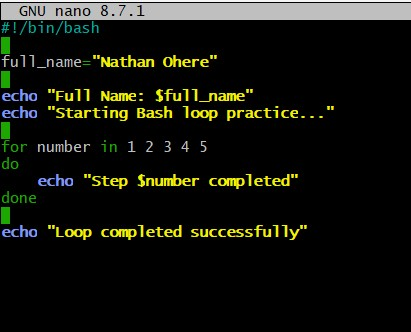

---

#### Screenshot 2 — Output of `./counter.sh`

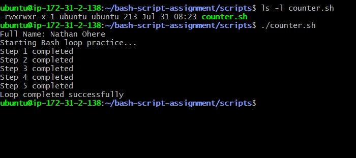

---

### Notes

Answer the following in your own words:

**1. What is a loop?**

A loop is a programming construct that repeats a block of code multiple times, either for a fixed number of repetitions or until a certain condition is met. Instead of writing the same instructions over and over manually, a loop lets the script execute that logic repeatedly in a compact, automated way.

---

**2. Why do we use loops in Bash scripting?**

Loops save time and reduce repetition in scripts. They're useful for tasks like processing multiple files, looping through a list of items in an array, retrying a command until it succeeds, or performing the same setup steps a set number of times — all without duplicating code for each iteration.

---

**3. How many times did the loop run in your script?**

The loop ran 5 times. This is because the for loop was defined as `for number in 1 2 3 4 5`, so it iterated once for each value in that list — printing "Step 1 completed" through "Step 5 completed" before moving on to the final "Loop completed successfully" message.

---

**4. What would you change if you wanted the loop to run 10 times?**

I would change the list of values in the for loop to include numbers 1 through 10, either by writing them out — `for number in 1 2 3 4 5 6 7 8 9 10` — or more concisely using range syntax: `for number in {1..10}`. Either way, the loop would then execute once for each number from 1 to 10, printing "Step 1 completed" through "Step 10 completed".

---

# Task 6 — Files & Conditionals: File Validation Script

## Goal

Use file checks and conditionals to verify whether files and directories exist.

### Evidence

#### Screenshot 1 — Output of `ls -lah ../test-folder`

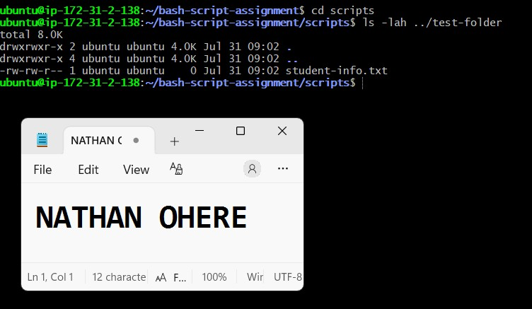

---

#### Screenshot 2 — Content of `file-check.sh`

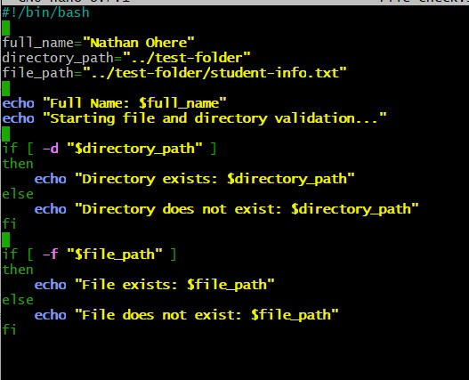

---

#### Screenshot 3 — Output of `./file-check.sh`

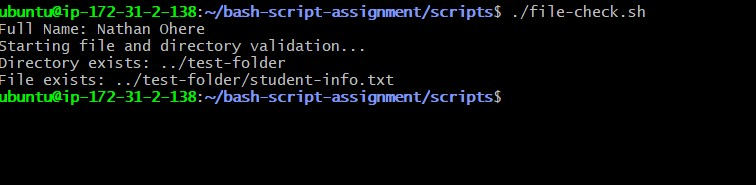

---

### Notes

Answer the following in your own words:

**1. What does `-d` check in Bash?**

The -d flag checks whether a given path exists and is specifically a directory. In the script, `if [ -d "$directory_path" ]` evaluates to true only if "../test-folder" exists and is a folder — as confirmed by the output "Directory exists: ../test-folder" in the terminal.

---

**2. What does `-f` check in Bash?**

The -f flag checks whether a given path exists and is specifically a regular file (not a directory). In the script, `if [ -f "$file_path" ]` evaluates to true only if "../test-folder/student-info.txt" exists as an actual file — which matched the output "File exists: ../test-folder/student-info.txt".

---

**3. Why should file and directory paths be stored in variables?**

Storing paths in variables (like directory_path and file_path) makes the script easier to read, maintain, and update. If the path ever needs to change, it only has to be updated in one place — the variable definition — instead of hunting through the entire script wherever that path was used. It also reduces the risk of typos causing inconsistent paths across multiple lines.

---

**4. What happens if the file does not exist?**

If the file does not exist, the -f check evaluates to false, and the script moves into the else block instead, printing a message like "File does not exist: $file_path". The script doesn't crash or throw an error — it simply follows the alternate path defined for that condition, which is the whole point of using an if/else check before trying to work with a file.

---

# Task 7 — Conditionals: Pass or Retry Script

## Goal

Use if-else conditionals to make decisions based on a variable value.

### Evidence

#### Screenshot 1 — Content of `score-check.sh` with `score=85`

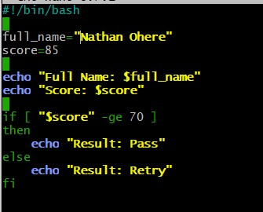

---

#### Screenshot 2 — Output showing `Result: Pass`

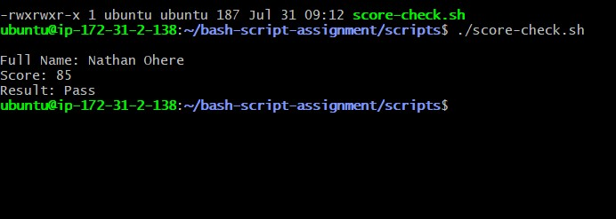

---

#### Screenshot 3 — Content of `score-check.sh` with `score=55`

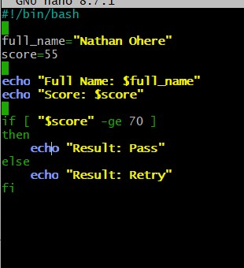

---

#### Screenshot 4 — Output showing `Result: Retry`

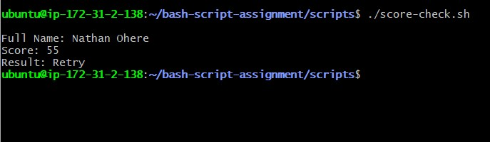

---

### Notes

Answer the following in your own words:

**1. What is the purpose of if-else in Bash?**

if-else allows a script to make decisions and run different blocks of code depending on whether a condition is true or false. Instead of the script always doing the exact same thing every time, it can check something — like whether a file exists, a number meets a threshold, or a variable matches a value — and respond differently based on the result.

---

**2. What does `-ge` mean?**

-ge stands for "greater than or equal to." It's used in Bash numeric comparisons, for example `if [ "$number" -ge 10 ]`, which evaluates to true if the value of $number is 10 or higher.

---

**3. Why should conditions be tested with different values?**

Testing with different values (edge cases, typical cases, and clearly invalid cases) confirms the condition actually behaves as expected in every scenario, not just the one case that happened to be tried first. For example, testing a -ge 10 check with 9, 10, and 11 confirms the boundary itself works correctly, catching mistakes like using -gt instead of -ge that might otherwise go unnoticed.

---

**4. How can conditionals help in automation scripts?**

Conditionals let automation scripts make smart decisions on their own instead of blindly running the same steps regardless of the situation. For example, a deployment script could check if a service is already running before starting it, verify a file exists before trying to process it, or confirm a resource has enough disk space before proceeding — making the automation safer, more reliable, and able to handle real-world variability without needing a person to step in.

---

# Task 8 — Functions: Final Bash Automation Script

## Goal

Create a final Bash script using functions to organize reusable code.

### Evidence

#### Screenshot 1 — Content of `final-automation.sh`

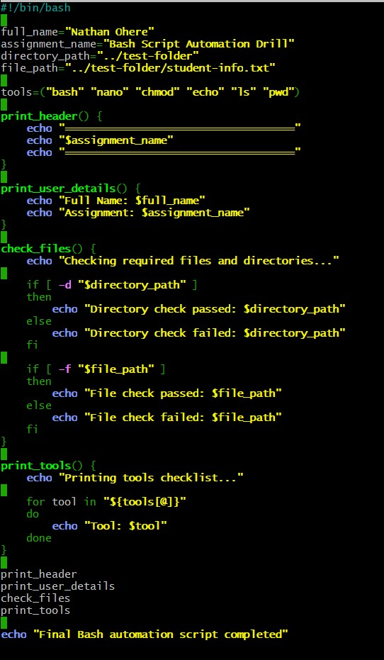

---

#### Screenshot 2 — Output of `./final-automation.sh`

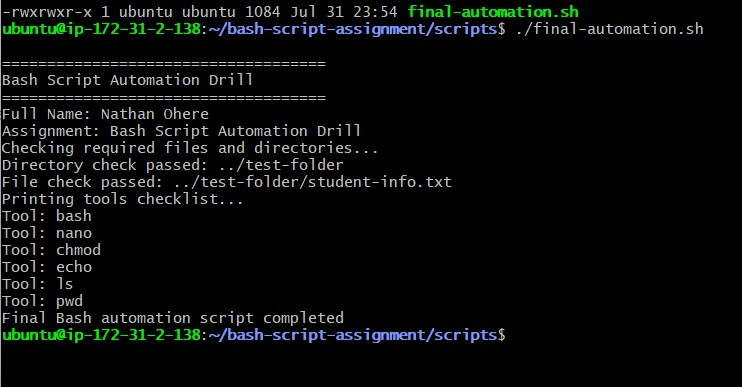

---

#### Screenshot 3 — Output of `ls -lah` showing all created scripts

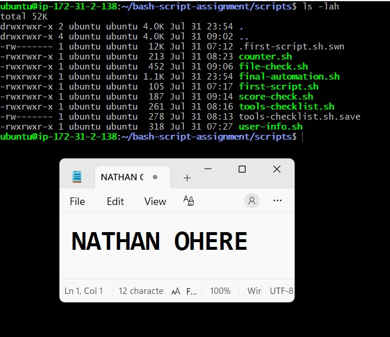

---

### Notes

Answer the following in your own words:

**1. What is a function in Bash?**

A function in Bash is a named block of code that groups together a set of commands so they can be reused multiple times throughout a script without rewriting them. Once defined, a function can be called by its name whenever that logic is needed, optionally passing in arguments to customize its behavior each time it's called.

---

**2. Why are functions useful in scripts?**

Functions make scripts more organized, readable, and maintainable by breaking complex logic into smaller, named, reusable pieces — instead of one long block of repeated code. If a piece of logic needs to change, it only needs to be updated in the function definition itself, and every place that calls the function automatically benefits from the fix. They also make scripts easier to test and debug, since each function can be reasoned about on its own.

---

**3. Which functions did you create in this script?**

I created four functions: print_header() to display a formatted title banner with the assignment name, print_user_details() to output my full name and assignment name, check_files() to validate that the required directory and file exist using -d and -f checks, and print_tools() to loop through an array of tool names and print each one individually.

---

**4. How does this final script combine variables, arrays, loops, conditionals, files, and functions?**

The script starts by defining variables (full_name, assignment_name, directory_path, file_path) to store reusable values, and an array (tools) holding a list of command-line tool names. These are then used inside four functions: print_header() and print_user_details() simply echo out the stored variables, check_files() uses if-else conditionals with -d and -f to test whether the directory and file paths actually exist on the system, and print_tools() uses a for loop to iterate through "${tools[@]}" and print each tool in the array. Finally, the script calls all four functions in sequence at the bottom, so running it end-to-end demonstrates variables, arrays, loops, conditionals, file/directory checks, and functions all working together in one coordinated automation flow — confirmed by the terminal output showing the header, user details, passed file/directory checks, and the full tools list printed correctly.

---

# LinkedIn Post (Required)

## Evidence

#### LinkedIn Post URL

Paste your LinkedIn post URL here:

https://www.linkedin.com/feed/update/urn:li:share:7489126253745295360/

---

#### Screenshot — Published LinkedIn post

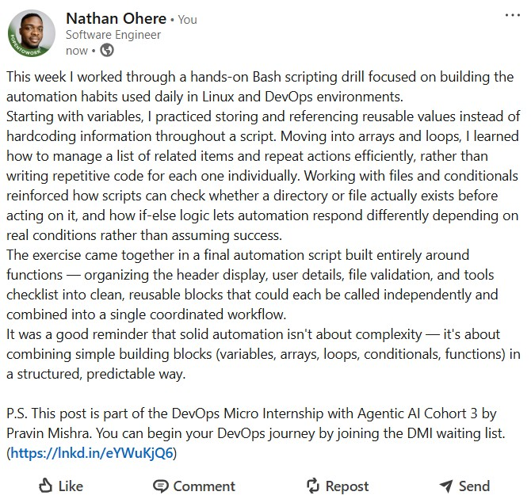

---

# Submission Instructions

- Add all required screenshots in your submission
- Full name must be visible in required screenshots
- All script files must be created and run successfully
- Required notes must be answered clearly for every task
- Do not expose sensitive information (keys, passwords, credentials)

---

# Completion Checklist

- [ ] Task 1: Environment setup verified, workspace created (Screenshots 1–2, Notes answered)
- [ ] Task 2: First script created, executed, permissions verified (Screenshots 1–3, Notes answered)
- [ ] Task 3: Variables script created and run (Screenshots 1–2, Notes answered)
- [ ] Task 4: Arrays and loops script created and run (Screenshots 1–2, Notes answered)
- [ ] Task 5: Counter loop script created and run (Screenshots 1–2, Notes answered)
- [ ] Task 6: File validation script created and run (Screenshots 1–3, Notes answered)
- [ ] Task 7: Pass/Retry conditional script tested with both values (Screenshots 1–4, Notes answered)
- [ ] Task 8: Final automation script created and run (Screenshots 1–3, Notes answered)
- [ ] All scripts run without errors
- [ ] Full Name visible in all required screenshots
- [ ] LinkedIn post published and URL submitted
- [ ] No sensitive data exposed

---

## 📌 About DMI & CloudAdvisory

DevOps Micro Internship (DMI) is a project-based DevOps program run by Pravin Mishra (The CloudAdvisory) focused on real-world execution, systems thinking, and career readiness.

It helps learners build strong DevOps foundations with hands-on experience.

---

## 📌 Resources

- 🌐 DMI Official Website: https://pravinmishra.com/dmi  
- 🎓 DevOps for Beginners (Udemy): https://www.udemy.com/course/devops-for-beginners-docker-k8s-cloud-cicd-4-projects/  
- 🎓 Agentic AI DevOps with Claude Code: https://www.udemy.com/course/ultimate-agentic-ai-devops-with-claude-code/  
- 🎓 DevOps with Claude Code: Terraform, EKS, ArgoCD & Helm: https://www.udemy.com/course/devops-with-claude-code-terraform-eks-argocd-helm/  
- ▶️ YouTube Playlist: https://www.youtube.com/playlist?list=PLFeSNDtI4Cho  
- 🔗 Pravin Mishra (LinkedIn): https://www.linkedin.com/in/pravin-mishra-aws-trainer/  
- 🏢 CloudAdvisory (LinkedIn): https://www.linkedin.com/company/thecloudadvisory/

---

*This submission is part of DevOps Micro Internship (DMI) Cohort 3 — Agentic AI Track.*